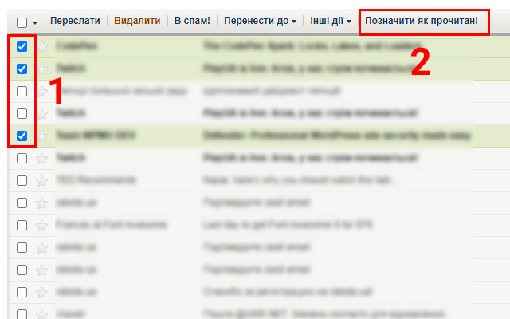
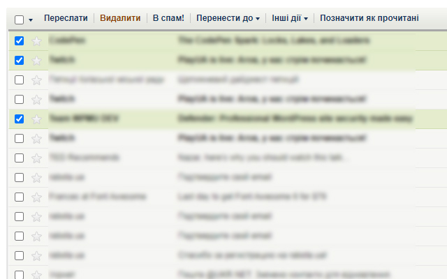
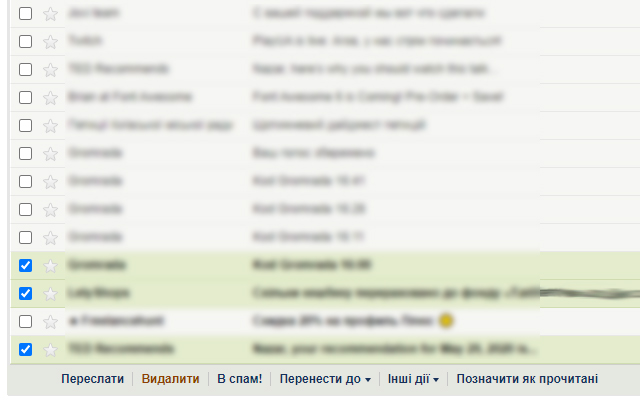

<h1>
  
  Mark As Read Button for [ukr.net]
</h1>

A small browser extension, which adds the "Позначити як прочитані (Mark as read)" button. It allows us to mark emails as read.

### Description

The "Mark as read" button appears in the top and bottom menus on the main page mail.ukr.net. It allows you to mark selected letters as read, without opening the letters. The button is visible only when the user works with the list of messages, because when you open the email, it automatically becomes read and there is no need for the button.

### Download

- [Mozilla add-on](https://addons.mozilla.org/uk/firefox/addon/mark-as-read-button/)

### Screenshots

- - - 

- - - 

